# Overview

This is a prototype for a kind of multi-level genetic algorithm demonstrating a
form of self-determination. The purpose is to give a concrete example of what
such an algorithm would look like, to motivate and serve as a foundation for
future work in this space. Although this algorithm is inherently complex, this
version is meant to be as simple as possible. There’s much room for improvement
and elaboration, but that is left for [future work](#future-work).

For this demo, the algorithm is used to evolve Game of Life scenarios that
perform well on a number of fitness goals. First, several hand-tuned
configurations are pitted against each other to see what they can do. Second,
the genetic algorithm is applied to tuning its own configuration and
optimizing its own search process, improving performance beyond what could be
achieved with human design. That is, I'm experimenting with self-determination
by using a genetic algorithm to design a genetic algorithm and steer its
evolution.

This isn’t exactly science yet. It’s more of a “try and see what works”
exploration than an attempt to test any specific hypothesis. It’s not yet
grounded in established work in the AI field. Nothing here has been analyzed or
justified with appropriate mathematical riggor. That will come later.

***TODO: once you've figured out the outer loop and generated all the examples
you're going to, grab some eye-catching GOL videos from the output directory***

# Game of Life

This demo uses Conway’s Game of Life (GOL) as the toy universe for a genetic
algorithm. For those not familiar with the GOL, consider reading this
[overview](https://conwaylife.com/wiki/Conway's_Game_of_Life) and spending some
time playing with this [interactive demo](https://playgameoflife.com/).

The GOL was chosen for a few reasons. First and foremost, the genetic algorithm
is producing a *program* that needs to be executed and evaluated for fitness,
not a single output value. This will be important for [future
work](#future-work), where this algorithm may be adapted to different sorts of
programming tasks. As computer programs go, a GOL scenario is about as simple
as they come. It takes no input, it’s fully deterministic, has no dependencies,
and aside from the game board itself it has no state or output.

Other reasons for using the GOL are that it’s relatively well known and
produces nice visuals that make it clear how well the genetic algorithm is
performing. It’s also easy to optimize with [parallel
execution](#design-considerations).

That said, doing cool things with the GOL is *not* a primary goal for this
project. If you’re a GOL aficionado and would like to help make this work more
interesting and useful to your community, your input would be very welcome!
Please [contact the author](mailto:nate.gaylinn@gmail.com) for possible
collaborations.

# Algorithm Overview
This is a specialized example of a genetic algorithm. For an introduction to
genetic algorithms for a general audience, see ***TODO: link to blog post***

This demo is structured so as to run a series of experiments and generate all
the data and visualizations needed to summarize the results found in this
README file. A major focus of this demo is comparing how different genome
configurations perform with different fitness goals. There is no one “best
design” for a GOL genetic algorithm. What design is preferred (the genome
configuration) depends on what sorts of GOL scenarios are considered to be the
best (fitness goals).

## Genome Configurations

This project has four predefiend ways to generate GOL scenarios, which are
expressed in terms of `GenomeConfigurations`. Basically, this project
transforms a genotype (initially just random bits) into a phenotype (the
initial state of a GOL board). How to interpret the raw data of the genotype
and what to do with it is determined by the `GenomeConfiguration`, which
decides whether each gene is set to a fixed value or randomized and how it is
allowed to change over generations. Different `GenomeConfigurations` allow the
genetic algorithm to explore different subsets of the phenotype space and
discover different solutions to fitness challenges.

### Control
The simplest GenomeConfiguration is just a randomized 64x64 grid of cells,
populated with a range of different densities.

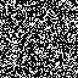
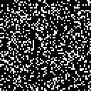

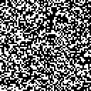
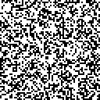
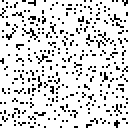

### Tile
Tile the game board with an 8x8 grid of cells, repeated and optionally
mirrored. Although this searches a very limited subset of the phenotype space,
working with a tiny 8x8 grid makes it relatively easy to evolve interesting
cell patterns. Repeating that pattern many times is a quick way to amplify its
effect and quickly find high-performing solutions to some fitness goals. This
configuration also supports mirroring, which means every other instance of the
tile is flipped, changing the ways tiles interact with each other along their
edges.

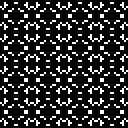
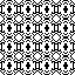
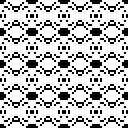
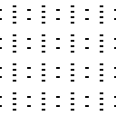
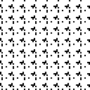


### Stamp
Like Tile, except the algorithm has much more control over how the 8x8 grid of
cells gets positioned and repeated. This has many of the same benefits of the
Tile configuration, but greater flexibility. This means it can sometimes find
better solutions, but it may take longer to find them since it’s searching a
much larger space of possibility.

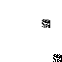
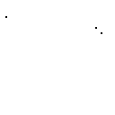
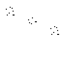
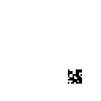
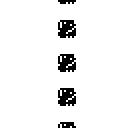
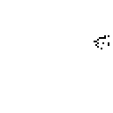

### Freeform
All genes are randomly generated and allowed to evolve freely. In effect, this
lets the algorithm choose between any of the above configurations and even
switch between them from one generation to the next.

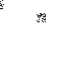
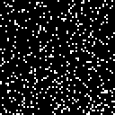
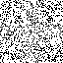
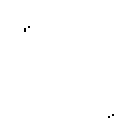
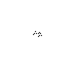
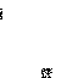

## Fitness Goals
This genetic algorithm produces GOL scenarios, which are each run for 100 steps
to produce a short video. The fitness of each scenario is determined by looking
at just a few frames from that video (usually from the beginning / end) and
counting up how many / which cells are alive. This produces a fitness score,
which is just a number on an arbitrary scale. Larger values are considered
better.
- **Active**: Maximize cells changed in the last frame.
- **Still Life**: Maximize living cells that didn't change in the last frame.
- **Explode**: Start with as few live cells as possible and end with as many as
  possible.
- **Full**: Maximize living cells in the last frame.
- **Two cycle**: Maximize the number of cells oscillating between two states at
  the end of the simulation.
- **Three cycle**: Maximize the nubmer of cells oscillating between three
  states at the end of the simulation.
- **Left to right**: Start with the most living cells on the left and end with
  the most on the right.
- **Symmetry**: Maximize the number of live cells in the last frame with
  horizontal / vertical mirror symmetry.

## Phase One
This project has two phases of experimentation. The first phase serves to
measure the performance of the genetic algorithm in all four of the predefined
`GenomeConfigurations` against all four of the fitness goals. For each of those
combinations, the algorithm will: 
- Randomly generate a population of 32 genotypes (that's how many can run
  simultaneously on the available GPU hardware). Each genotype consists of
  a set of concrete values for each gene in the genome, constrained to the
  current `GenomeConfiguration`.
- Transform the genotype into a phenotype, which is the first frame of a GOL
  simulation. The genotype is treated as a simple program which is evaluated to
  create a phenotype, which is just an initial configuration of a GOL board
  like the ones [above](#genome-configurations).
- Run every GOL simulation for 100 steps and evaluate their performance given
  the current [fitness goal](#fitness-goals).
- Randomly choose pairs of individuals from the population for breeding, in
  proportion to their fitness scores.
- Produce a new population either by cloning one parent or by remixing the
  genes from both parents (an operation known as crossover), then introducing a
  few random mutations into the offspring.
- Repeat for 200 generations and graph the best fitness over time.
- Record a video of the most fit GOL simulation from this configuration

Since this algorithm depends heavily on randomness, the results will vary
significantly on each run. For this reason, the whole procedure is repeated 5
times, and the results are averaged across those trials.

***TODO: Provide runtime stats***

## Phase Two
Phase two abandons the default `GenomeConfigurations` and instead attempts to
evolve one that will do better. This means exploring the possible initial
values, crossover rates, and mutation rates. Importantly, mutation and
crossover behavior can be configured per gene, not just globally for the whole
genotype. This allows the algorithm to decide which genes benefit from a broad
search and which should be carefully preserved.

Another goal of this project is to give the algorithm a meaningful way of
steering its own evolution, taking historical performance into account. In
phase two, this project uses a `FitnessVector` to indicates whether an
individual's parent was more, less, or equally fit compared to its grandparent.
Mutation and crossover values are be conditioned on this fitness vector. This
allows the algorithm to act to preserve valuable innovations or mitigate
harmful regressions produced by mutation.

***TODO: Explain the procedure, once you've worked it out.***

***TODO: Provide runtime stats***

***TODO: Try running stage one for an equivalent number of generations, just to
show that this will outperform that.***

# Results
This section provides a short discussion of the data produced in the `output`
directory including some interesting patterns and examples. Feel free to
explore the data yourself. There's more than is covered here.

## Experiment data
The first thing to note about this experiment design is that there is a high
degree of variability between runs. Since genetic algorithms depend
heavily on randomness and the space of possible GOL solutions is so huge, this
is unavoidable. Sometimes this takes the form of a single trial that got
unreasonably lucky and outperformed all the rest. Sometimes the trials span a
wide range of possibilities or even settle into a bimodal pattern, likely
indicating that the algorithm settled into a local maximum.

Below are some charts example fitness charts chosen to illustrate the variation
between trials (most experiments actually have less variation than this). Each
one shows fitness data from five trials of 200 generations each. Note that
as generations go by, fitness generally moves upward in spurts representing
lucky mutations. It occassionally dips, indicating that by chance some
important genes were lost from the gene pool.

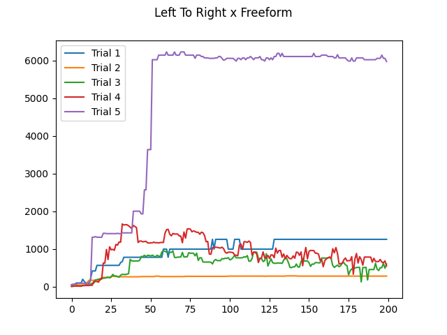
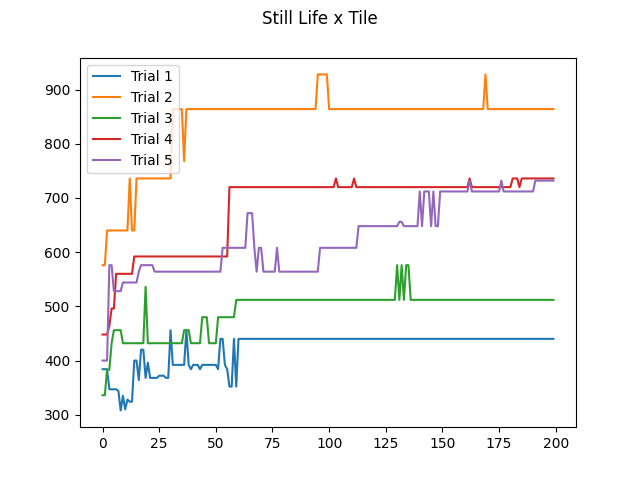
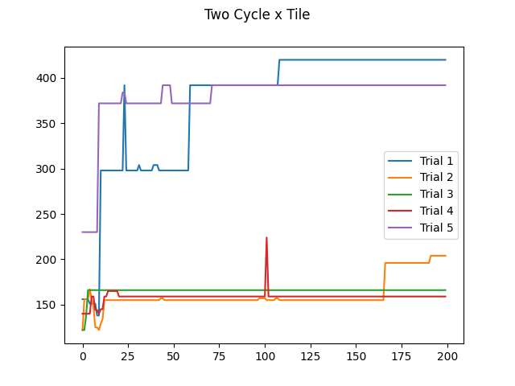

To try to compare the overall performance of each configuration, we can't just
look at a single trial, but must average over several. We do that in two ways.
First is the "median fitness trajectory." This is found by taking just the
median performance in each generation (to minimize the influence of outliers)
and doing a simple linear regression to show the learning rate. Second, we look
at the best fitness across all trials, and the spread of those values.

Below is the summary comparing performance across four genome configurations in
one experiment. In this case, we can see that the Stamp and Freeform
configurations were best able to learn better phenotypes over time. In
contrast, the Control configuration could barely learn at all, but still tended
to get pretty high fitness scores just because it produced phenotypes with lots
of live cells in a wide range of configurations and got lucky now and then.

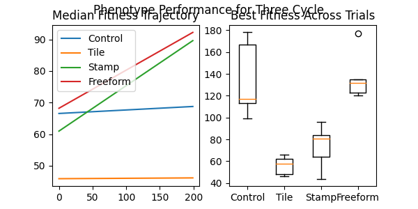

## Genome Configurations
From these experiments, it's clear that some genome configurations are much
better for some fitness goals than others. In general, the Control
configuration struggled to gain traction on many problems. This is likely
because it uses the full GOL board as its canvas. That means the phenotype
typically changes by a few pixels in each generation just from mutation, and
those changes tend to produce very chaotic consequences after 100 simulation
steps. The chart below shows what that looks like. Note that fitness varies
wildly in each generation and there's no upward trajectory.

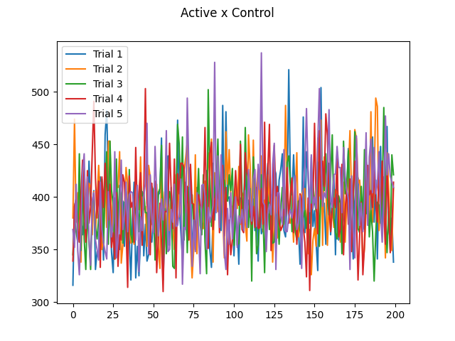

The Tile genome configuration does extremely well in some scenarios, but not
others. This is because it has the most constrained set of genes, meaning it
searches over a smaller space of possibilities. If a good solution to the
fitness goal lies in that space, it is likely to find it quickly. However, in
some scenarios, it simply can't find a good solution by  filling all available
space with a repeated pattern.

The Stamp configuration is very flexible and is often the best learner in the
bunch. The Freeform configuration is, in theory, just as flexible, but it often
gets stuck acting like Control rather than Stamp. That's because while Stamp is
a much better learning, Control still does better in some scenarios where lots
of randomness occasionally gets high fitness scores by luck alone.

## Fitness Goals
Not every fitness goal is analyzed here, just a selection of interesting
results.

### Explode
The Explode experiment features excellent performance from the Stamp and
Freeform genome configurations. They have an innate advantage in this task,
because they can easily produce phenotypes with just a few live cells, clumped
close together. By contrast, the Tile configuration has an innate disadvantage,
since it is forced to draw many live cells distributed all over the board in
the first frame.

|||||
| :-----: | :------: | :---: | :--: |
| Control | Freeform | Stamp | Tile |

Interestingly, this was the only example where one of the experiments had a
clear, sustained *downward* fitness trajectory. Generally this happens when a
genetic algorithm is not learning well and is just exploring the possibility
space randomly, but still is able to stumble upon "pretty good" phenotypes in
the initial population. In this case, low density phenotypes made by the
Control configuration tended to do pretty well, but changing them one cell at a
time rarely made them any better.  

### Left to Right
The Left to Right experiment is notable because different genome configurations
found radically different strategies for getting a high fitness score. The
Control configuration was able to use crossover to find a somewhat "cheaty"
solution, where the left half of the board starts out overly dense (and thus
dies out immediatley) while the right half has moderate density and produces
a lively cell population.

The Stamp and Freeform configurations both found a strategy where a dense
pattern just left of center produces a cascading effect that surges into the
right half of the board and fills that space with activity.

The Tile configuration is at a disadvantage, since it has no way to draw more
live cells on one side than the other. It gets around this by exploiting
interactions with the right hand edge. Its repeating pattern quickly collapses
to empty space, except on the right where it survives and even rebounds back to
fill more space.

|||||
| :-----: | :------: | :---: | :--: |
| Control | Freeform | Stamp | Tile |

### Symmetry
Tile has a huge innate advantage on this fitness goal, which it uses to make a
complex pattern with two degrees of symmetry. While the Freeform and Stamp
configurations *could* mimic Tile, it would require a lot of luck for them to
evolve a phenotype that's perfectly aligned with the board's center and
produces a symmetric pattern. However, they found another clever strategy. By
narrowing the stamp's repeat offset so the stamps overlap each other, they can
produce phenotypes with long, smeared lines that fill the full width of the
board and thus produce patterns with symmetry. In contrast, Control has an
innate disadvantage, since it must change its design one pixel at a time and
it's very unlikely for that to happen symmetrically.

|||||
| :-----: | :------: | :---: | :--: |
| Control | Freeform | Stamp | Tile |

### Two Cyle and Three Cycle
For Two Cycle, both Tile and Stamp have a strong innate advantage. They can
find small patterns that oscillate in the 8x8 stamp relatively easily, then
repeat those patterns many times. The challenge for them is mostly how densely
they can pack the phenotype with oscillators! Interestingly, Three Cycle
represents a much more evenly matched competition. That's because the easiest
period-three oscillator pattern to evolve is a
[Pulsar](https://conwaylife.com/wiki/Pulsar), a pattern too big to fit into an
8x8 stamp. Although a pulsar is symmetrical, it has an odd number of cells per
side, which means the mirror operation as currently defined cannot reproduce
it.

Two Cycle:
|||||
| :-----: | :------: | :---: | :--: |
| Control | Freeform | Stamp | Tile |

Three Cycle:
|||||
| :-----: | :------: | :---: | :--: |
| Control | Freeform | Stamp | Tile |

## Reproducing these Results
This code requires an NVidia GPU with CUDA support. It is currently configured
for a single GPU device with
[Compute Capability 8.x](https://docs.nvidia.com/cuda/cuda-c-programming-guide/index.html#compute-capabilities).
It should work with other models, but you may need to adjust the constants in
`kernel.py` to fit your device.

This project depends on several common Python libraries which you can install
by running the following commands:
```bash
# For generating charts and data visualizations
pip install matplotlib
# For writing GPU accelerated code
pip install numba
# For efficient array manipulation
pip install numpy
# For exporting animated gifs
pip install Pillow
# For drawing simple progress bars
pip install progress
```

To run the experiments described [above](#algorithm-overview):

`python3 rebuild_output.py`

To run the included tests:

`python3 -m unittest discover`

# Distinctiveness
This genetic algorithm is different from most other examples for a few key
reasons:
- **Phenotype Design**:
    - Most genetic algorithms aim to find a good genotype, which is often
      just a sequence of characters that either is the answer to some problem,
      or can be trivially transformed into an answer. The range of possible
      genotypes and how they are interpreted is the responsibility of the
      programmer, who must design them carefully to produce the best possible
      results for the needs of their project.
    - In this case, there are several different fitness goals and thus no best
      design for phenotype construction. Instead, several different methods are
      considered. In the second phase of experimentation, the phenotype
      construction process is left open ended (to a limited extent) and the
      genetic algorithm itself is given influence over its design.
      Therefore, *both* the genotype *and* its interpretation are outputs of
      this program.
- **Custom Mutations / Latent Genes**:
    - Many genetic algorithms depend on “custom mutations” to improve
      performance. These are just ways of introducing random variations in the
      next generation that are more clever than simple bit flipping. For
      instance, a developer might use their domain knowledge to try tweaking
      the data in fruitful ways, do some post-processing to avoid obviously
      broken genotypes, or avoid clobbering or breaking up useful patterns that
      may have evolved in the genotype.
    - This algorithm doesn’t use custom mutations, but achieves the same goal
      using “latent genes.” Basically, some genes are used to choose between
      different behaviors. For any given lifetime, those genes have a fixed
      value, enabling some behaviors and disabling others. Between generations,
      which genes are enabled can change via mutation, potentially swapping
      one reasonable behavior for another. For example, mirroring a stamp is
      one way of introducing possibly fruitful variation while preserving
      existing patterns within the genome.
- **Evolved Wayfinding**:
    - Every genetic algorithm is effectively a search process, looking
      through the space of all possible genotypes for the one that will produce
      the best fitness. In most genetic algorithms, this search process is
      controlled by the framework, which is responsible for fitness-weighted
      mate selection and managing the rate of mutations.
    - This algorithm leaves mate selection to the framework (this may change in
      [future work](#future-work)), but mutation is in control of the evolved
      population. By finding different mutation rates for each gene, the
      algorithm can bias its search to more fruitful parts of the search space.
      By using a [fitness vector](#phase-two), mutation and crossover rates can
      be tuned up or down depending on whether this genotype seems to be
      thriving or struggling.

# Biological Realism
This project is inspired by two key observations about biological evolution:
- Life doesn’t just evolve a program that determines the behavior of an
  organism. It also evolves a programming language and an interpreter for that
  language at the same time. In this way, life can find efficient and robust
  encodings for evolving programs that solve particular problems. In other
  words, each species has evolved a range of possible forms and behaviors, and
  each individual lies somewhere in that space of possibility. Mutations are
  more likely to lead to other forms and behaviors that are still within that
  established space, which is generally supportive of the kind of niches and
  lifestyles available to that species.
- Life plays an active role in its own evolution. Mutation rates are not
  controlled by the Universe, but are carefully managed by evolved mechanisms
  within the cell. In particular, there are a host of epigenetic processes that
  allow mutation rates to change in response to experience, and this can happen
  globally, regionally, or localized to a specific gene.

This project is designed to be as simple as possible while still capturing the
spirit of those observations. It attempts to follow the same principles, but
not in a way that is biologically plausible. There are many ways in which this
project does not resemble real life, some of the most notable being:
- **Two-tiered evolution**: Normally, the shape and behavior of the genome is
  evolved along with the organism’s phenotype in a continuous process. That
  wasn’t possible here, since the mechanism for managing the genome was not
  evolved, but designed by the programmer. In nature, a process called
  “canalization” makes older, more fundamental genes more stable over time,
  providing a reliable background for the mutation of other genes. That happens
  automatically in evolution, but must be added in artificially for designed
  software. The nested evolutionary processes described [above](#phase-two) is
  a naive attempt to do this, but it’s totally different from what life
  actually does.
- **Organism isolation**: In this project, each individual organism exists
  within a single 64x64 GOL board, which serves both as its body and its
  universe. There is no distinction between self and environment. There is no
  interaction with any other organism, except for breeding, which is tightly
  controlled by the framework. This is all profoundly unrealistic, and
  precludes many fascinating natural phenomena.
- **Epigenetic mechanisms**: The concept of a “genome configuration” is
  inspired by chromatin markers on DNA and the epigenome, but only very
  loosely. There is no attempt to model biochemistry or to reproduce mutation
  management behaviors observed in real organisms. The concept of a “fitness
  vector” is inspired by stress-induced mutation factors. The information
  passed between generations is minimized to make it more biologically
  plausible, but there’s no reason to think life actually does anything like
  this.
- **Open-endedness**: This project gives the evolutionary process some
  influence over the interpretation and variation of the genotype, but not
  much. The range of possible options is still quite narrow, defined by the
  programmer, and unchangeable. In real life, the range of possibilities is
  itself evolved and plastic, but that was too complex to attempt in this
  project (see [future work](#future-work)).

# Design Considerations
- **Domain Specialization**: Although this project uses the GOL as its problem
  domain, the code for genotype and phenotype doesn’t have any GOL-specific
  logic. It should work just as well for generating any sort of 2D bitmap. This
  means it should work well for other cellular automata or for any problem
  where a phenotype can reasonably be described using a 2D bitmap.
- **GPU Parallelization**: This program is written in Python, mostly because
  it’s easy to read and write and good for rapid prototyping. It’s also
  painfully slow to run. To work around this limitation, the inner loop of this
  program is highly optimized. It uses the Numba library to transpile Python
  code into C, which is then run on an NVIDIA GPU using the CUDA toolkit. This
  enables simulating 32 organism lifetimes simultaneously in just XXms.
  ***TODO: actual stats***
  Importantly, transferring data from the GPU is painfully slow. Capturing each
  frame to video as it is computed would slow everything down by a factor of 10
  or more. Instead, only the frames needed to compute fitness are captured by
  default, and full simulation videos of just the fittest organisms are
  recorded in a second pass.
- **Genome Modeling**: This program has an explicit representation of the
  organism genome, which includes all possible genes represented as high-level
  types (enums, integers, vectors, and arrays). This makes it relatively easy
  and elegant to provide custom code for interpreting and varying the genotype
  between generations without directly manipulating a string of bits, as many
  genetic algorithms do. There is also an elaborate process for constraining a
  genome with a configuration, and using that to instantiate a concrete
  genotype for an individual GOL simulation. For more details on how this
  works, check out the comments and doc strings in `genome.py`,
  `genome_config.py`, and `gene_types.py`.
- **Nestable Evolution**: This program runs several genetic algorithms, so
  it seemed natural to factor out some basic infrastructure for that purpose.
  In order to support the two-tiered genetic algorithm (see
  [above](#phase-two)), this infrastructure needed to support evolving
  different kinds of individuals and even running an genetic algorithm
  from within an genetic algorithm. This was achieved by letting the
  caller create the initial population and do all the work of running and
  evaluating the fitness of each generation. The infrastructure is responsible
  only for selection, propagation, and bookkeeping.
- **Debug and testing**: In order to validate that the code is actually working
  as intended required adding a basic debugger and a few unit and integration
  tests. The debugger allows the developer to inspect whole populations from
  generation to generation, and set breakpoints for major fitness changes and
  particular breeding events in order to investigate them. The tests aren’t
  meant to be exhaustive, but just to document behavior, provide basic sanity
  checks, and detect major regressions.

# Future Work
- **Open-endedness**: The genome and phenotype design for this project are as
  simple as they can be and still illustrate the effect of self-determination
  on an genetic algorithm. The algorithm can influence its own design, but
  only within a very limited range defined by the programmer. In theory,
  defining the genome and phenotype in a much more flexible and open-ended way
  should produce more dramatic results. A v2 for this project is already in the
  works to explore this possibility.
- **Other kinds of programs / RL**: While GOL scenarios are technically
  "computer programs," they are about as simple as they come and not
  practically usefuls. In theory, the principle behind this project could be
  useful for the evolved design of *any* program. In particular, this approach
  is likely well suited to the design of reinforcement learning agents, since
  in a sense that's what life uses it for.
- **Diverse populations / mate selection**: Nature doesn't evolve individual
  organisms, but diverse ecosystems that collaborate and compete with each
  other. This is considered a major source for life's robustness and emergent
  complexity, two things lacking from computer programs today. In addition,
  life is generally obsessed with sexual selection, which is a major tool for
  influencing the direction of evolution.
- **More layers / DL**: This project is a two-layer intelligent system, very
  loosely mimicking cells and bodies in biology. Nature frequently builds
  intelligent systems with *many* layers, not just two. It would be interesting
  to explore the evolution of more complex systems, especially ones that
  integrate deep learning models with evolved programs.
