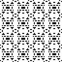
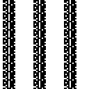
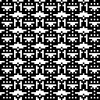
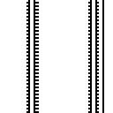
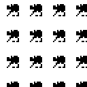
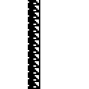

Project by Nate Gaylinn:
[github](https://github.com/ngaylinn),
[email](mailto:nate.gaylinn@gmail.com),
[blog](https://thinkingwithnate.wordpress.com/)

# Overview


This is a prototype for an "epigenetic algorithm," a variant on the traditional
genetic algorithm inspired by epigenetics and modern evolutionary theory. The
purpose of the project is to get specific about what such an algorithm might
look like, explore how it behaves, and figure out the potential for future work
in this space. This isn't exactly science yet. There's no formal hypothesis.
The project is not yet grounded in established work in the AI field. Nothing
here has been analyzed or justified with appropriate mathematical rigor. That
will come later.

There are two observations about life on Earth that motivate this experiment:
- Life doesn't just evolve a gene sequences for each organism. It also evolves
  a genome for each species.
- Mutations aren't purely random. Life seems to manage mutation rates in a
  genome-aware way.

For more on this, check out the section on [biological
realism](#biological-realism) below.

One hypothesis related to these observations is that life evolves ways to
evolve more efficiently. The genome for a species restricts the space of
possible forms an organism can take to ones proven effective within its niche,
while leaving enough flexibility for individual variation and continuing
evolution. Managing mutation rates allows life to influence the search process
over this space, protecting against dangerous mutations in critical genes, but
encouraging variation where it is safe and potentially useful. In short, life
optimizes the search for lifestyles, evolving ways of finding better solutions
faster over time.

This project attempts to reproduce that phenomenon in an artificial context.
The algorithm is inherently complicated, but was kept relatively simple for the
first pass. Rather than aiming for the most dramatic results, the goal was to
try a few different ideas to see which ones are most promising and learn about
the problem in the process. There are lots of exciting ways to make this
algorithm better, some of which are discussed int he section about [future
work](#future-work).

For this demo, the algorithm is used to evolve Game of Life simulations with
interesting properties, as determined by some arbitrarily chosen fitness goals.
This is just an example use case, and the algorithm should generalize to other
problems. In addition to evolving Game of Life simulations, the demo also
evolves different *ways* to evolve those simulations, and compares them
head-to-head to see which is more effective. More details of this project's
design, motivation, and execution can be found [below](#technical-overview).
The full results and analysis of these experiments are available [here](
https://github.com/ngaylinn/epigenetic-gol-prototype-results).

# Game of Life


This demo uses Conway's Game of Life (GOL) as a playground for genetic
algorithms. For those not familiar with the GOL, you may want to check out this
[introduction ](https://conwaylife.com/wiki/Conway's_Game_of_Life) and try
playing with this [interactive demo](https://playgameoflife.com/).

The GOL was chosen for a few reasons. First and foremost, this project is meant
to evolve *programs* that generate solutions, not just solutions themselves.
This will be important for [future work](#future-work), where this algorithm
may be adapted to different sorts of programming tasks. As computer programs
go, a GOL simulation is about as simple as they come. It takes no input, it's
fully deterministic, has no dependencies, and aside from the game board itself,
it has no state or output.

Other reasons for using the GOL are that it's relatively well known and
produces nice visuals that make it clear how well the genetic algorithm is
performing. It's also easy to optimize with [parallel
execution](#kernel-design).

That said, doing cool things with the GOL is *not* a primary goal for this
project. If you're a GOL aficionado and would like to help make this work more
interesting and useful to your community, your input would be greatly
appreciated! Please [contact the author](mailto:nate.gaylinn@gmail.com) for
possible collaborations.

# Motivation



The biggest practical limitation of genetic algorithms is that they require an
expert programmer to optimize the algorithm design to fit their specific use
case. They carefully design a variety of phenotypes and encoding scheme to
describe them with a gene sequence. They devise clever mutation and crossover
strategies to make the search process more efficient. But why should a
programmer to do this hard work by hand, when life can do the same thing via
evolution?

The mechanisms of epigenetics serve to manage the interpretation and variation
of the gene sequence. This project explores one way of doing the same thing in
an artificial context. Rather than fine-tuning the performance of a single
genetic algorithm designed for a single fitness goal, this is more like
searching over many possible genetic algorithms to find which one gets the best
traction on the problem.

If successful, this might one day lead to genetic algorithms that are more like
deep learning foundation models. A powerful generic model could be built by
specialists, then automatically fine-tuned to a specific narrow task on demand.
It might also produce results that are more open-ended, flexible, and life-like
than traditional genetic algorithms.

# Technical Overview

## Genetic Algorithm



This is a specialized example of a genetic algorithm. For a brief intro to
genetic algorithms for a general audience, see this [blog
post](https://thinkingwithnate.wordpress.com/2022/10/06/why-genetic-algorithms/)
by the author.

This genetic algorithm is different from most others in a few key ways:
- **Genome Design**:
    - The aim of most genetic algorithms is to find a good gene sequence, which
      is often just a string of characters / digits that is the answer to some
      problem, or can be trivially transformed into the answer. The language
      for writing this gene sequence and how to interpret it as an answer is up
      to the programmer, who must design it carefully to produce the best
      possible results for the needs of their project.
    - In this case, there are several different fitness goals and thus no one
      best design for a gene sequence. Instead, this project considers several
      different flavors of gene sequence, and even tries to evolve ones that
      perform better than the hand-designed alternatives. This gives the
      genetic algorithm a degree of influence over the design and search
      process. This means that *both* the genome *and* the solutions it
      produces are outputs of this program.
- **Custom Mutations / Latent Genes**:
    - Many genetic algorithms depend on “custom mutations” to improve
      performance. These are just ways of introducing random variations in the
      next generation that are more clever than simple bit flipping. For
      instance, a developer might use their domain knowledge to try tweaking
      the data in fruitful ways, do some post-processing to avoid obviously
      broken genotypes, or avoid breaking up useful patterns that may have
      evolved in the genotype.
    - This algorithm doesn't use custom mutations, but achieves the same thing
      using latent genes. Basically, some `Gene`s are used to choose between
      different behaviors. For any given lifetime, those `Gene`s have a fixed
      value, enabling some behaviors and disabling others. Between generations,
      which `Gene`s are enabled can change via mutation, potentially swapping
      one reasonable behavior for another. For example, a `Gene` for mirroring
      a patch of the GOL board is one way of introducing new variations while
      preserving existing patterns within that patch.
- **Evolved Wayfinding**:
    - Every genetic algorithm is effectively a search process, looking through
      the space of all possible genotypes for the one that will produce the
      best fitness. In most genetic algorithms, this search process is
      controlled by the framework, which is responsible for mate selection,
      remixing genes from parents ("crossover"), and causing mutations.
    - This algorithm leaves mate selection to the framework (this may change in
      [future work](#future-work)), but mutation and crossover are controlled
      by the evolved population. By using per-gene mutation rates and a
      `FitnessVector` ([see below](#variations)), the genetic algorithm can
      bias its search towards more fruitful parts of the search space based on
      prior experience.

## Evolution


The `evolution` module provides some basic infrastructure for evolving
populations to perform well on fitness goals defined in the `fitness` module.

The `Lineage` class handles the basic process of creating an initial
population, running their simulated lifetimes, evaluating fitness, selecting
the next generation, and tracking how fitness evolves over many generations.
The `Evolvable` class represents a single individual in the population. Both
`Lineage` and `Evolvable` are abstract base classes, meaning they are useless
on their own, but can be subclassed to implement a wide variety of genetic
algorithms.

This project uses [Stochastic Universal
Sampling](https://en.wikipedia.org/wiki/Stochastic_universal_sampling) for
selection. This is a method for randomly choosing individuals from a population
with a likelihood proportional to their fitness, while avoiding extreme outlier
scenarios like picking the same individual every time.

The fitness for a `GameOfLifeSimulation` is determined using one of the goals
defined in the `fitness` module. Each simulation is run for 100 steps, while a
video is recorded. The fitness goals look at the first and / or last few frames
of that video, and do some spot checking to see what the simulation did over
its lifetime. For a walkthrough of the fitness goals used by this project,
checkout the [experiment
analysis](https://github.com/ngaylinn/epigenetic-gol-prototype-results/blob/main/ANALYSIS.md).
All fitness scores are integers, with an arbitrary scale for each fitness goal.
Two scores for the same goal are comparable to each other, but they are *not*
comparable with different goals.

## Genome Configurations


This project compares different ways of interpreting and modifying a gene
sequence. This requires a more complicated model of the genome than is found in
most genetic algorithms. The code for this representation is spread across the
`genome`, `genome_configuration`, and `gene_types` modules. It uses several
concepts borrowed from biology. Here's how those words should be understood
within the context of this project:
- **Gene**: The basic unit of information in the `GENOME`. Each `Gene`
  represents some data or option used to produce a `GameOfLifeSimulation`. For
  instance, there's a `Gene` representing a 2D grid of data that can be copied
  onto the game board, and another `Gene` representing what portion of that
  grid should be used (all, or just a small patch of it). Each `Gene` has a
  type and a range of possible values. When breeding two individuals, `Gene`s
  are the unit of recombination. That is, we always keep one copy of each
  `Gene`, and the mutation and crossover operations respect the type and
  boundaries of each `Gene` (instead of treating the `Genotype` as an
  undifferentiated string of bits).
- **Genome**: A collection of all the `Gene`s used to produce a GOL simulation,
  and their allowed values. The `GENOME` represents the space of possible GOL
  simulations which the genetic algorithm will search over. It can be combined
  with a `GenomeConfig` to produce a `Genotype`. This project uses the same
  `GENOME` for every `GameOfLifeSimulation`.
- **GenomeConfig**: Constrains the `GENOME` and its evolution. It is
  responsible for two things: rates of mutation / crossover, and deciding which
  `Gene`s are randomized / fixed during evolution. By fixing a `Gene` to a
  specific value, the `GenomeConfig` can restrict what kinds of
  `GameOfLifeSimulation` are possible.
- **Genotype**: A concrete instantiation of the genome used by a particular
  individual to make a `GameOfLifeSimulation`. The genetic algorithm starts
  with randomized `Genotype`s, then evolves them into ones that produce more
  fit `GameOfLifeSimulation`s. What `Genotype`s are allowed and how they change
  through the experiment is determined by the `GenomeConfig`.

### Variations

The purpose of the `GenomeConfig` class is to shape the process of evolving a
`GameOfLifeSimulation` by changing mutation and crossover behavior. There are
several predefined `GenomeConfig` options in the `genome` module, which mostly
serve as a basis for comparison (for an overview of these, check out the
[analysis](https://github.com/ngaylinn/epigenetic-gol-prototype/blob/main/README.md).
This project also *evolves* a `GenomeConfig` for each fitness goal. How best to
do that is unclear, so this project tests two ideas:
- **FitnessVectors**: This lets the algorithm condition mutation and crossover
  rates based on how well an individual's parent did compared to its
  grandparent. Did fitness go up, down, or stay the same? In theory, this
  context could allow the algorithm to be more conservative to preserve useful
  innovations, take greater risks out of desperation, or other such strategies.
- **Per-Gene Configuration**: Rather than tuning the evolutionary process
  globally, do it gene-by-gene. The `GeneConfig` class allows configuring
  relative mutation rates for each `Gene`, as well as setting fixed values for
  them instead of letting them evolve freely. In theory, this could allow the
  algorithm to prioritize mutations where they are safe and useful, while
  avoiding them where they'd be most harmful. It also allows for constraining
  the range of possible simulations, which could let the algorithm avoid wasted
  effort exploring less fruitful design options.

This project tests the full cross product for both of these ideas. That is, it
evolves a `GenomeConfig` using both capabilities, with each one independently,
and without using either of them. When both `use_fitness_vector` and
`use_per_gene_config` are false, the project will evolve values for global
crossover and mutation rates to compare against the default rates used when
evolving `GameOfLifeSimulation`s from the predefined `GenomeConfig`s.

## Kernel Design



This program is written in Python, mostly because it's easy to read and good
for rapid prototyping. Python is also painfully slow to run. To work around
this limitation, the inner loop of this program is optimized. It uses the Numba
library to transpile Python code into C, which is just-in-time-compiled and run
on an Nvidia GPU using the CUDA library. This enables running 32 GOL
simulations for 100 steps in parallel in just a few milliseconds.

The `kernel` module contains all the CUDA code, which is used to translate the
genotype into a GOL simulation and run that simulation to completion. It
handles all memory management for the GPU, which is important for performance.
The `gol_simulation` module serves as the interface between the `kernel` module
and the rest of the program, so the CUDA code is well isolated.

While the code for running a GOL simulation is very use-case specific, the
`make_phenotypes` function (which interprets the genotype to create a GOL
simulation) is *not*. That code is for making generic 2D bitmaps and contains
no reference to the GOL. In the future, it might be used to evolve other kinds
of cellular automata, or any other phenotype that can reasonably be represented
as a 2D bitmap.

## Experiment Design


The `experiments` module uses the infrastructure provided in the `evolution`
module to define genetic algorithm experiments for evolving
`GameOfLifeSimulation`s and `GenomeConfig`s.

The `simulation_experiment` function uses the `SimulationLineage` class 
to evolve `GameOfLifeSimulation`s for a course of 200 generations. Since
genetic algorithms depend heavily on randomness, the results can vary quite a
bit, even when using exactly the same `GenomeConfig`. For this reason, each
experiment actually runs five trials, so that we can analyze the average
performance and weed out extreme outliers (whose performance likely has more to
do with luck than the `GenomeConfig` being tested).

The `genome_experiment` function uses the `GenomeLineage` class to evolve
`GenomeConfig`s for a course of 50 generations. The "lifetime" for each
individual is another genetic algorithm experiment, attempting to evolve
`GameOfLifeSimulation`s from the work-in-progress `GenomeConfig`s. Like a
`simulation_experiment`, five `SimulationLineage` trials are evolved for 200
generations each. The fitness of the `GenomeConfig` is determined by the
`weighted_median_integral` function, which is somewhat arbitrary but chosen to
prefer lineages that produce high-fitness `GameOfLifeSimulation`s *and* show
reliably increasing fitness over generations / across trials.

A single `simulation_experiment` requires evolving five lineages for 200
generations with 32 individuals each, which amounts to 6,400 simulated
lifestyles. Thanks to [GPU acceleration](#kernel-design) this only takes a few
seconds. In contrast, a `genome_experiment` does that same process for 1,600
individual `GenomeConfig`s and can take *hours*. To avoid lost work and make
iterative analysis possible, the `ExperimentState` class is used to implement
basic pause / resume support, saving partial results to disk.

The `rebuild_output` module is responsible for orchestrating all these
experiments, analyzing the results, generating charts, and populating a
directory with all the data. The full results with explanation and analysis can
be found
[here](https://github.com/ngaylinn/epigenetic-gol-prototype/blob/main/README.md).

## Execution



This code requires an Nvidia GPU with CUDA support. It is currently configured
for a single GPU device with [Compute Capability
8.x](https://docs.nvidia.com/cuda/cuda-c-programming-guide/index.html#compute-capabilities).
It should work in other configurations, but you may need to adjust the
constants in the `kernel` module header to fit your device.

This project depends on several common Python libraries which you can install
by running the following commands:
```bash
# For writing GPU accelerated code
pip install numba

# For fast and easy arrays and data tables
pip install numpy
pip install pandas

# For making charts and data visualizations
pip install matplotlib
pip install seaborn

# For exporting animated gifs
pip install Pillow

# For rendering progress bars on the command line
pip install tqdm
```

To run the experiments and reproduce the results:

`python3 rebuild_output.py`

There are also a handful of tests to document behavior and do some basic sanity
checking. You can run them with the following command:

`python3 -m unittest discover`

For more in-depth exploration, the `debug` module provides some basic tools to
inspect and visualize the process of evolving `GameOfLifeSimulation`s. Just
uncomment the "debug" lines in the `experiments` module to get started.

### Known Issues

On some machines, this script will occasionally crash without any error or
debug information when generating charts after a very long experiment run. It
seems likely this is an issue in one of the underlying C++ libraries. If this
happens, the fix is simple: restart the script, and it will pick up where it
left off. If you have insight into this bug or would like to provide a patch,
please contact [the author](mailto:nate.gaylinn@gmail.com). To ensure the
program runs to completion without supervision, consider the following BASH
script:

```bash
while true
do
	python3 rebuild_output.py
	if [ $? -eq 0 ]
	then
		break
	fi
done
```

# Biological Realism



This project is loosely inspired by the science of epigenetics (for a good
introduction, check out [Evolution in Four
Dimensions](https://www.goodreads.com/review/show/4526346279) by Jablonka and
Lamb). That said, biological realism is *not* a goal here. Instead, this
project is designed to be similar to existing genetic algorithms, with just a
couple of biologically-inspired twists.

There are two key observations about biological evolution that this program is
exploring:
- The language of genetics was *not* provided by a programmer, but was evolved
  by life itself. The tree of life represents a wide variety of forms, each
  flexible and still evolving, but working within a range of possible shapes
  and lifestyles established by the genome of each species. From a
  computational perspective, life doesn't just evolve a program that determines
  the behavior of an organism. It also evolves a programming language, an
  interpreter, and a collection of libraries for that language at the same
  time. This ought to have an accelerating effect on the process of evolution,
  by constraining the space of possible phenotypes considered.
- Life plays an active role in its own evolution. Mutation rates are *not*
  controlled by the Universe, but are carefully managed by evolved mechanisms
  within the cell. There are a variety of epigenetic processes that maintain
  mutation rates within a narrow range, and adjust them in response to
  experience, for the whole gene sequence, for a portion of it, or even for
  just a single gene. This ought to have an accelerating effect on the process
  of evolution, by allowing life to optimize the process of searching the space
  of phenotypes considered.

There are *many* ways in which this project is *not* biologically plausible.
Most obvious is the two-tiered evolution scheme. Life doesn't separate the
process of evolving a genome from evolving individual genotypes—both happen
concurrently. In nature, a process called “canalization” makes older, more
fundamental genes more stable over time, providing a reliable background for
the mutation of other genes. That doesn't happen in this artificial context, so
the two-tiered design is used to approximate the same phenomenon.

The genome model is inspired by DNA and its chromatin markers, but it is
drastically simplified and resembles the real biological versions in only the
*loosest* possible sense. The `FitnessVector` concept is sorta inspired by
stress-induced mutation, but has no equivalent in nature. Also, the standard
conceit of many genetic algorithms where individuals live in hermetic isolation
and compete for a high fitness score is profoundly unrealistic.

# Future Work



This project is just a proof of concept meant to establish a baseline and get
feedback before going too deep on a wild idea. There are lots of places where
this work could go from here:
- **Open-endedness**: The genome and phenotype design for this project are as
  simple as they can be and still allow the genetic algorithm a degree of
  contextual awareness and self-determination. The genome can be "configured"
  to explore a small range of possible behaviors, but it can't be "programmed"
  in an open-ended way. With a more complex genome design, it should be
  possible to explore a much wider range of behaviors that might produce more
  dramatic results, finding better solutions, faster, to harder fitness
  challenges. The author is already considering more elaborate designs inspired
  by [A Taxonomy for Artificial
  Embryogeny](https://ieeexplore.ieee.org/abstract/document/6790626) by Ken
  Stanley and Risto Miikkulainen.
- **Other kinds of programs / reinforcement learning**: While GOL simulations
  are technically "computer programs," they are about as simple as they come
  and not practically useful. In theory, the principle behind this project
  could be used to evolve *any* kind of program. It would be particularly
  interesting to evolve reinforcement learning agents, capable of observing a
  virtual environment, interacting with it, and making decisions. After all,
  that's what life does with this sort of genetic algorithm.
- **Diverse populations / mate selection**: Nature doesn't evolve individual
  organisms, but diverse ecosystems that collaborate and compete with each
  other. This is considered a major source for life's robustness and emergent
  complexity, two things lacking in modern AI systems. In addition, life is
  generally obsessed with sexual selection, which is a major tool for
  influencing the direction of evolution. These would be natural topics to
  explore.
- **More layers / deep learning**: This project is a two-layer intelligent
  system, very loosely mimicking cells and bodies in biology. Nature frequently
  builds intelligent systems with *many* layers, not just two. For instance,
  organisms with brains are born with innate knowledge, faculties, and
  behaviors, *and* they use experience within a lifetime to refine, extend, and
  override them. It would be interesting to produce something similar by
  combining an evolved program with a neural network in the same way.
